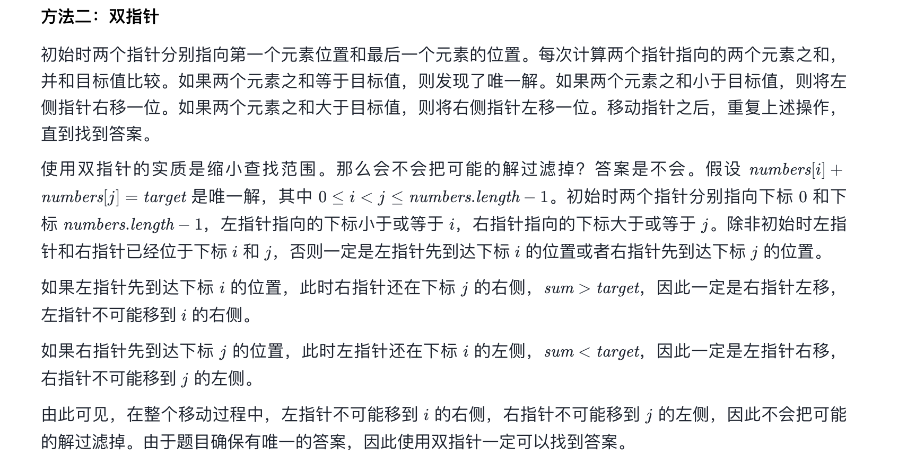

// 链接：https://leetcode-cn.com/problems/two-sum-ii-input-array-is-sorted
// 给定一个已按照 非递减顺序排列  的整数数组 numbers ，请你从数组中找出两个数满足相加之和等于目标数 target 。

// 函数应该以长度为 2 的整数数组的形式返回这两个数的下标值。numbers 的下标 从 1 开始计数 ，所以答案数组应当满足 1 <= answer[0] < answer[1] <= numbers.length 。

// 你可以假设每个输入 只对应唯一的答案 ，而且你 不可以 重复使用相同的元素。

//  
// 示例 1：

// 输入：numbers = [2,7,11,15], target = 9
// 输出：[1,2]
// 解释：2 与 7 之和等于目标数 9 。因此 index1 = 1, index2 = 2 。
// 示例 2：

// 输入：numbers = [2,3,4], target = 6
// 输出：[1,3]
// 示例 3：

// 输入：numbers = [-1,0], target = -1
// 输出：[1,2]
//  

// 提示：

// 2 <= numbers.length <= 3 * 104
// -1000 <= numbers[i] <= 1000
// numbers 按 非递减顺序 排列
// -1000 <= target <= 1000
// 仅存在一个有效答案


双指针



```

 var twoSum = function(numbers, target) {
    let left = 0 ;
    let right = numbers.length - 1
        while(left < right){
            let sum = numbers[left]+numbers[right]
            if(sum===target){
                return [left+1,right+1]
            }else if(sum<target){
                left++
    
            }else{
                right--
            }
        }
        return [-1,-1]
    };
```

//也可以使用两数之和的解法 

    var twoSum = function(nums, target) {
    var temp = [];
        for(var i=0;i<nums.length;i++){ // 普通for循环 
            var dif = target - nums[i]; //计算出 差值
            if(temp[dif] != undefined){ // 有可能 差值保存的位置在 索引（index）为0的位置 所以不可以写为if（temp[dif]）                             // 当访问数组中不存在的元素时 默认返回undefined 
            if(temp[dif] > i)return [i+1,temp[dif]+1]
                return [temp[dif]+1,i+1];   //找到两数之和 返回下标 （index）
            }
            temp[nums[i]] = i;   //数组中不存在该元素 向数组中进行插入
        }
        return [-1,-1]
    };