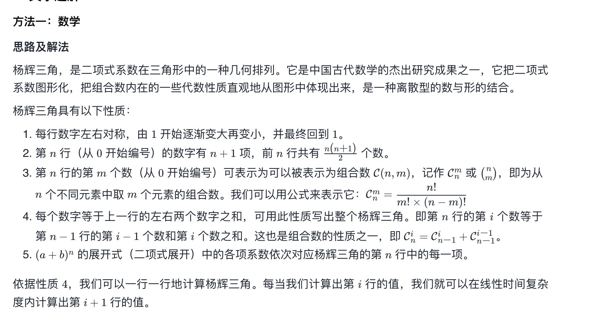

https://leetcode-cn.com/problems/pascals-triangle/

杨辉三角，是二项式系数在三角形中的一种几何排列。它是中国古代数学的杰出研究成果之一，它把二项式系数图形化，把组合数内在的一些代数性质直观地从图形中体现出来，是一种离散型的数与形的结合。

杨辉三角具有以下性质：

题解：

    var generate = function(numRows) {
    const ret = [];

    for (let i = 0; i < numRows; i++) {
        const row = new Array(i + 1).fill(1);
        for (let j = 1; j < row.length - 1; j++) {
            row[j] = ret[i - 1][j - 1] + ret[i - 1][j];
        }
        ret.push(row);
    }
    return ret;
    };

