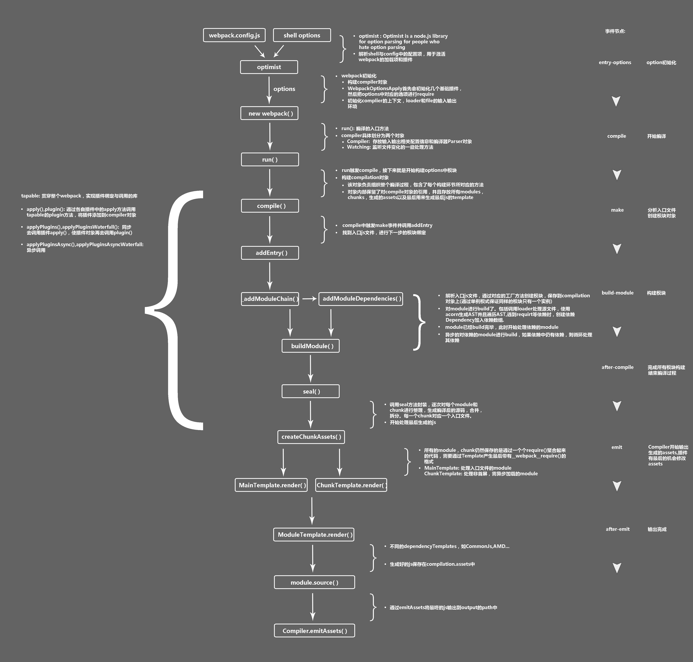
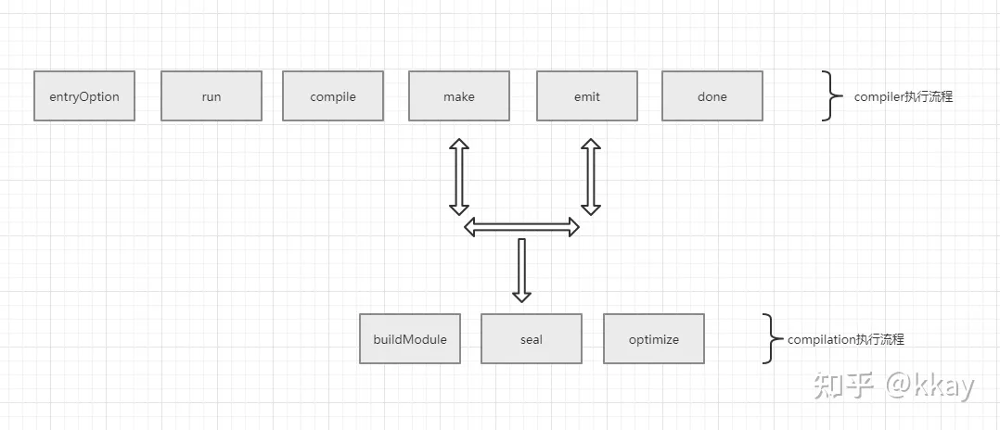

webpack执行流程 -- 阿里

https://mp.weixin.qq.com/s/LI-SkBoPA94Ply6Qes92PA

简而言之,compiler执行到make和emit之间时,compilation对象便出场了,它会依次执行它定义的一系列钩子函数,像代码的编译、依赖分析、优化、封装正是在这个阶段完成的.

compilation实例主要负责代码的编译和构建.每进行一次代码的编译(例如日常开发时按ctrl + s保存修改后的代码),都会重新生成一个compilation实例负责本次的构建任务.

整体执行流程已经梳理了一遍,接下来深入到上图中标记的每一个钩子函数,理解其对应的时间节点.

entryOption:webpack开始读取配置文件的Entries,递归遍历所有的入口文件.
run: 程序即将进入构建环节
compile: 程序即将创建compilation实例对象
make:compilation实例启动对代码的编译和构建
emit: 所有打包生成的文件内容已经在内存中按照相应的数据结构处理完毕,下一步会将文件内容输出到文件系统,emit钩子会在生成文件之前执行(通常想操作打包后的文件可以在emit阶段编写plugin实现).
done: 编译后的文件已经输出到目标目录,整体代码的构建工作结束时触发

compilation下的钩子含义如下.

buildModule: 在模块构建开始之前触发,这个钩子下可以用来修改模块的参数
seal: 构建工作完成了,compilation对象停止接收新的模块时触发
optimize: 优化阶段开始时触发
compiler进入make阶段后,compilation实例被创建出来,它会先触发buildModule阶段定义的钩子,此时compilation实例依次进入每一个入口文件(entry),加载相应的loader对代码编译.